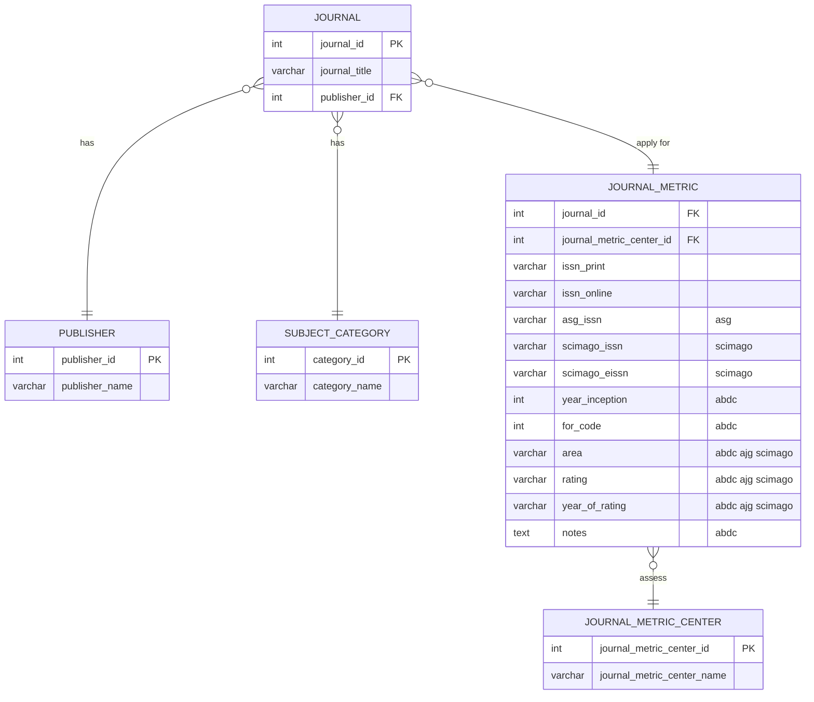

# Entity-Relationship Diagram

```mermaid
erDiagram
    JOURNAL }o--|| PUBLISHER : has
    JOURNAL }o--|| SUBJECT_CATEGORY : has 
    JOURNAL }o--|| JOURNAL_METRIC : "apply for"
    JOURNAL_METRIC }o--|| JOURNAL_METRIC_CENTER : assess

    JOURNAL {
        int journal_id PK
        varchar journal_title
        int publisher_id FK
    }
    PUBLISHER {
        int publisher_id PK
        varchar publisher_name
    }
    SUBJECT_CATEGORY {
        int category_id PK
        varchar category_name 
    }
    JOURNAL_METRIC {
        int journal_id FK
        int journal_metric_center_id FK
        varchar issn_print 
        varchar issn_online
        varchar asg_issn "asg"
        varchar scimago_issn "scimago"
        varchar scimago_eissn "scimago"
        int year_inception "abdc"
        int for_code "abdc"
        varchar area "abdc ajg scimago"
        varchar rating "abdc ajg scimago" 
        varchar year_of_rating "abdc ajg scimago"
        text notes "abdc"


    }
    JOURNAL_METRIC_CENTER {
        int journal_metric_center_id PK
        varchar journal_metric_center_name
    }

```