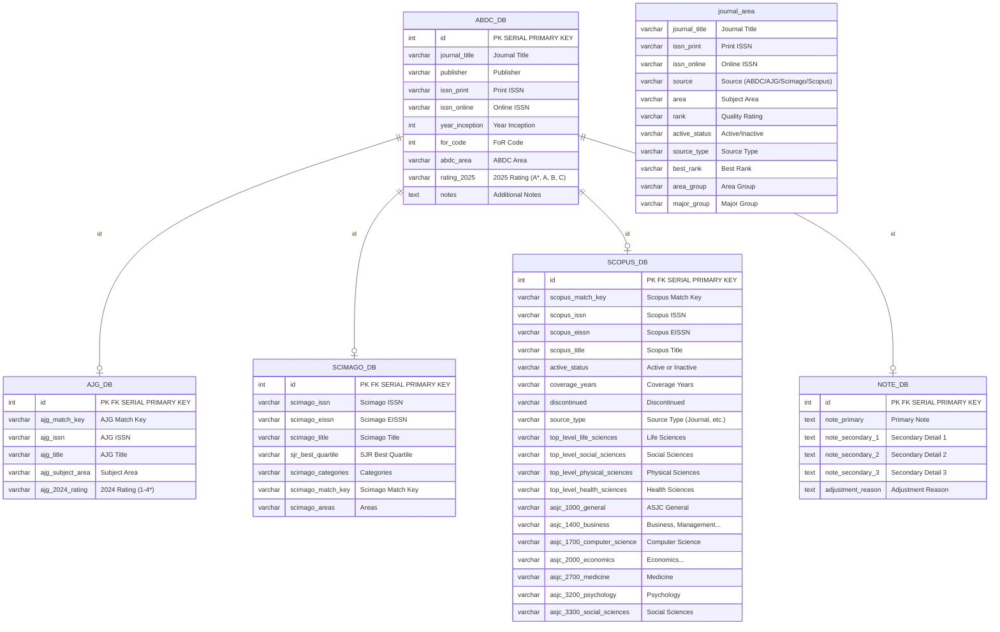

# Entity-Relationship Diagram



## Relationships

| Parent | Child | Type | Description |
|--------|-------|------|-------------|
| `ABDC_DB` | `AJG_DB` | One-to-Zero-or-One | Each ABDC journal may have an AJG record (matched by `id`) |
| `ABDC_DB` | `SCIMAGO_DB` | One-to-Zero-or-One | Each ABDC journal may have a Scimago record (matched by `id`) |
| `ABDC_DB` | `SCOPUS_DB` | One-to-Zero-or-One | Each ABDC journal may have a Scopus record (matched by `id`) |
| `ABDC_DB` | `NOTE_DB` | One-to-Zero-or-One | Each ABDC journal may have adjustment notes (matched by `id`) |
| — | `journal_area` | Standalone | A denormalized/aggregated view combining data from all source databases |
```
