# Entity-Relationship Diagram

```mermaid
erDiagram
    JOURNAL_MAIN ||--o| ABDC_DB : "id"
    JOURNAL_MAIN ||--o| AJG_DB : "id"
    JOURNAL_MAIN ||--o| SCIMAGO_DB : "id"
    JOURNAL_MAIN ||--o| SCOPUS_DB : "id"
    JOURNAL_MAIN ||--o| NOTE_DB : "id"
    JOURNAL_MAIN ||--o{ JOURNAL_AREA_DETAIL : "journal_id"
    JOURNAL_MAIN ||--o{ JOURNAL_AREA_GROUP_DETAIL : "journal_id"
    JOURNAL_MAIN ||--o{ JOURNAL_MAJOR_GROUP_DETAIL : "journal_id"
    JOURNAL_AREA_DETAIL }o--|| AREA : "area_id"
    JOURNAL_AREA_GROUP_DETAIL }o--|| AREA_GROUP : "area_group_id"
    JOURNAL_MAJOR_GROUP_DETAIL }o--|| MAJOR_GROUP : "major_group_id"

    JOURNAL_MAIN {
        int id "PK"
        varchar journal_title "Journal Title"
        varchar publisher "Publisher"
    }

    ABDC_DB {
        int id "PK FK"
        varchar issn_print "Print ISSN"
        varchar issn_online "Online ISSN"
        int year_inception "Year Inception"
        int for_code "FoR Code"
        varchar abdc_area "ABDC Area"
        varchar rating_2025 "2025 Rating (A*, A, B, C)"
        text notes "Additional Notes"
    }

    AJG_DB {
        int id "PK FK"
        varchar ajg_match_key "AJG Match Key"
        varchar ajg_issn "AJG ISSN"
        varchar ajg_title "AJG Title"
        varchar ajg_subject_area "Subject Area"
        varchar ajg_2024_rating "2024 Rating (1-4*)"
    }

    SCIMAGO_DB {
        int id "PK FK"
        varchar scimago_issn "Scimago ISSN"
        varchar scimago_eissn "Scimago EISSN"
        varchar scimago_title "Scimago Title"
        varchar sjr_best_quartile "SJR Best Quartile"
        varchar scimago_categories "Categories"
        varchar scimago_match_key "Scimago Match Key"
        varchar scimago_areas "Areas"
    }

    SCOPUS_DB {
        int id "PK FK"
        varchar scopus_match_key "Scopus Match Key"
        varchar scopus_issn "Scopus ISSN"
        varchar scopus_eissn "Scopus EISSN"
        varchar scopus_title "Scopus Title"
        varchar active_status "Active or Inactive"
        varchar coverage_years "Coverage Years"
        varchar discontinued "Discontinued"
        varchar source_type "Source Type (Journal, etc.)"
        varchar top_level_life_sciences "Life Sciences"
        varchar top_level_social_sciences "Social Sciences"
        varchar top_level_physical_sciences "Physical Sciences"
        varchar top_level_health_sciences "Health Sciences"
        varchar asjc_1000_general "ASJC General"
        varchar asjc_1400_business "Business, Management..."
        varchar asjc_1700_computer_science "Computer Science"
        varchar asjc_2000_economics "Economics..."
        varchar asjc_2700_medicine "Medicine"
        varchar asjc_3200_psychology "Psychology"
        varchar asjc_3300_social_sciences "Social Sciences"
    }

    NOTE_DB {
        int id "PK FK"
        text note_primary "Primary Note"
        text note_secondary_1 "Secondary Detail 1"
        text note_secondary_2 "Secondary Detail 2"
        text note_secondary_3 "Secondary Detail 3"
        text adjustment_reason "Adjustment Reason"
    }

    journal_area {
        int id "PK (auto-increment)"
        varchar journal_title "Journal Title"
        varchar issn_print "Print ISSN"
        varchar issn_online "Online ISSN"
        varchar source "Source (ABDC/AJG/Scimago/Scopus)"
        varchar area "Subject Area"
        varchar rank "Quality Rating"
        varchar active_status "Active/Inactive"
        varchar source_type "Source Type"
        varchar best_rank "Best Rank"
        varchar area_group "Area Group"
        varchar major_group "Major Group"
    }

    AREA {
        int area_id "PK (auto-increment)"
        varchar area_name "Area Name (unique)"
    }

    JOURNAL_AREA_DETAIL {
        int journal_id "PK FK"
        int area_id "PK FK"
    }

    AREA_GROUP {
        int area_group_id "PK (auto-increment)"
        varchar area_group_name "Area Group Name (unique)"
    }

    JOURNAL_AREA_GROUP_DETAIL {
        int journal_id "PK FK"
        int area_group_id "PK FK"
    }

    MAJOR_GROUP {
        int major_group_id "PK (auto-increment)"
        varchar major_group_name "Major Group Name (unique)"
    }

    JOURNAL_MAJOR_GROUP_DETAIL {
        int journal_id "PK FK"
        int major_group_id "PK FK"
    }
```

## Relationships

| Parent | Child | Type | Description |
|--------|-------|------|-------------|
| `JOURNAL_MAIN` | `ABDC_DB` | One-to-Zero-or-One | Each journal may have ABDC rating data (matched by `id`) |
| `JOURNAL_MAIN` | `AJG_DB` | One-to-Zero-or-One | Each journal may have an AJG record (matched by `id`) |
| `JOURNAL_MAIN` | `SCIMAGO_DB` | One-to-Zero-or-One | Each journal may have a Scimago record (matched by `id`) |
| `JOURNAL_MAIN` | `SCOPUS_DB` | One-to-Zero-or-One | Each journal may have a Scopus record (matched by `id`) |
| `JOURNAL_MAIN` | `NOTE_DB` | One-to-Zero-or-One | Each journal may have adjustment notes (matched by `id`) |
| `JOURNAL_MAIN` | `JOURNAL_AREA_DETAIL` | One-to-Many | Each journal may have multiple area associations |
| `JOURNAL_MAIN` | `JOURNAL_AREA_GROUP_DETAIL` | One-to-Many | Each journal may have multiple area group associations |
| `JOURNAL_MAIN` | `JOURNAL_MAJOR_GROUP_DETAIL` | One-to-Many | Each journal may have multiple major group associations |
| `AREA` | `JOURNAL_AREA_DETAIL` | One-to-Many | Each area may be associated with multiple journals |
| `AREA_GROUP` | `JOURNAL_AREA_GROUP_DETAIL` | One-to-Many | Each area group may be associated with multiple journals |
| `MAJOR_GROUP` | `JOURNAL_MAJOR_GROUP_DETAIL` | One-to-Many | Each major group may be associated with multiple journals |
| — | `journal_area` | Standalone | A denormalized/aggregated view combining data from all source databases |
